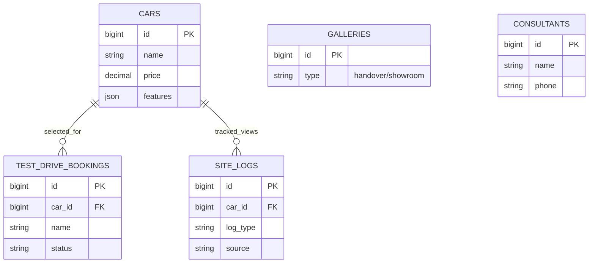

# Product Requirements Document (PRD) - AutoShow Pro

## 1. Project Overview
AutoShow Pro is a premium, SaaS-ready car dealership management system designed specifically for high-performing sales professionals. It focuses on high conversion rates through "Pro Max" aesthetic standards, seamless WhatsApp integration, and a robust backend for inventory and lead management.

---

## 2. Target Audience
- **Car Buyers (B2C):** Customers looking for a premium browsing experience and easy contact options.
- **Sales Consultants (End Users):** Professionals who manage their own digital showroom and track leads.
- **Platform Owners (SaaS Admins):** Entities managing multiple instances of the portal via the "Mothership" control center.

---

## 3. Key Features

### 3.1. Premium Front-End Experience
- **Cinematic Hero Slideshow:** Dynamic, high-impact banners for featured units.
- **"Break-the-Frame" Model Cards:** 3D-effect unit cards with glassmorphism styling.
- **Integrated Lead Capture:** Simplified booking forms for Test Drives and direct WhatsApp CTA.
- **Video Integration:** Support for cinematic car walkthroughs/reviews.

### 3.2. Robust Admin Dashboard (Filament PHP)
- **Inventory Management:** Full CRUD for vehicles with multi-image gallery support and PDF flyers.
- **Lead & Booking Tracking:** Centralized management of customer inquiries with status tracking.
- **Top Products Analytics:** Visual widget to monitor the most viewed/requested car models.
- **Consultant Profile:** Personal branding for sales consultants with social media & maps integration.
- **Handover Gallery:** Sales history tracking with "handover" and "showroom" categories.
- **Promo Management:** Flash banners and promotional content management.

### 3.3. SaaS & Licensing (Mothership Integration)
- **Remote License Control:** Ability to suspend/activate client sites remotely from a central Mothership app.
- **Verification Ping:** Periodic check-ins to ensure the instance is authorized.
- **Feature Gating:** Capability to enable/disable specific "Pro" features based on license tier.

---

## 4. Technical Architecture & Data Implementation

### 4.1. Technology Stack
- **Framework:** Laravel 11
- **Admin Panel:** Filament v3
- **Database:** MySQL / MariaDB
- **UI/UX:** Tailwind CSS + Vanilla CSS (Custom Glassmorphism)
- **Integration:** Mothership API (Remote Control)

### 4.2. Detailed Data Dictionary

#### A. Core Inventory (`cars`)
| Field | Type | Description |
| :--- | :--- | :--- |
| `id` | BigInt (PK) | Unique identifier for the car. |
| `name` | String | Commercial name of the vehicle. |
| `slug` | String (Unique) | URL-friendly name for SEO. |
| `category` | String | Vehicle type (EV, SUV, HEV, MPV). |
| `price` | Decimal (15,2) | OTR Price. |
| `description`| Text | Detailed specifications or marketing copy. |
| `features` | JSON (Cast) | List of key features/specs. |
| `image` | String | Primary thumbnail image path. |
| `hero_image` | String | High-res banner image path. |
| `images` | JSON (Cast) | Additional gallery images. |
| `flyer` | String | Path to PDF brochure. |
| `is_available`| Boolean | Stock availability status. |

#### B. CRM & Leads (`test_drive_bookings`, `leads`)
| Field | Type | Description |
| :--- | :--- | :--- |
| `id` | BigInt (PK) | Unique identifier. |
| `name` | String | Customer name (per ID). |
| `phone` | String | WhatsApp contact number. |
| `email` | String | Customer email address. |
| `car_id` | BigInt (FK) | Relation to `cars.id`. |
| `booking_date`| Date | Scheduled date for test drive. |
| `status` | String | Process status (`pending`, `confirmed`, `completed`, `cancelled`). |
| `source` | String | Traffic source (facebook, ig, direct). |
| `ip_address` | String | Captured IP for lead validation. |

#### C. Content & Media (`galleries`, `promos`, `videos`)
| Field | Type | Description |
| :--- | :--- | :--- |
| `id` | BigInt (PK) | Unique identifier. |
| `image` | String | Media file path. |
| `caption` | String | Image description. |
| `type` | String | Gallery category (`handover`, `showroom`). |
| `title` | String | Promo headline. |
| `video_url` | String | YouTube/Vimeo embed link for `videos`. |

#### D. System & SaaS Control (`settings`, `site_logs`)
| Field | Type | Description |
| :--- | :--- | :--- |
| `id` | BigInt (PK) | Unique identifier. |
| `key` | String | Setting identifier (e.g., `license_plan`, `is_suspended`). |
| `value` | Text | Setting value or token. |
| `log_type` | String | Event type (`visit`, `wa_click`). |
| `car_id` | BigInt (FK) | Optional relation to car being viewed. |
| `source` | String | Referring source (e.g., `facebook`). |
| `user_agent` | String | Visitor's browser/device info. |

---

### 4.3. Data Relationships (ERD)

---

### 4.4. Business Logic Implementation

1.  **Lead Tracking Logic:**
    - **Trigger:** Middleware `TrackVisits` menangkap setiap request ke halaman detail.
    - **Action:** Jika log_type adalah `visit`, sistem menyimpan `car_id`, `ip_address`, dan `source`.
    - **Analytics:** Data ini diproses secara real-time oleh `AiInsightsWidget` untuk memberikan saran strategi penjualan.

2.  **SaaS Suspension Logic:**
    - **Remote Command:** Mothership mengirim POST ke `/api/mothership-sync` dengan token valid.
    - **Action:** Middleware `CheckSuspended` melakukan intercept pada setiap request. Jika `is_suspended` aktif, sistem menampilkan view `errors.suspended`.

3.  **Pro Feature Gating:**
    - Menggunakan helper `Setting::isPro()`, sistem secara dinamis menampilkan/menyembunyikan widget analitik di Dashboard.

---

## 5. UI/UX Standards (Pro Max)
All components must adhere to the following:
1.  **Accessibility:** High contrast ratios and screen-reader friendly.
2.  **Performance:** Optimized images and lazy loading for high-res car galleries.
3.  **Premium Aesthetics:** Use of HSL-based color palettes, smooth transitions, dan subtle micro-animations (e.g., *Break-the-frame* model cards).

---

## 6. Security & Authentication
- **Admin Security:** Protected by Laravel's built-in authentication and Filament's session management.
- **Mothership Sync Security:** Token-based authentication menggunakan `X-Mothership-Token` header.
- **Developer Access:** Restricted "Developer Only" pages protected by OTP verification (`VerifyDeveloperOtp` middleware).

---

## 7. Success Metrics
- **Lead Conversion Rate:** Increase in test drive bookings vs. traditional landing pages.
- **User Engagement:** Time spent on car detail pages.
- **Operational Efficiency:** Reduction in time taken for Sales to update their inventory.
