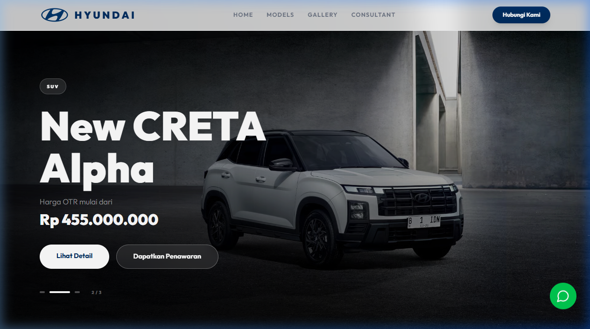
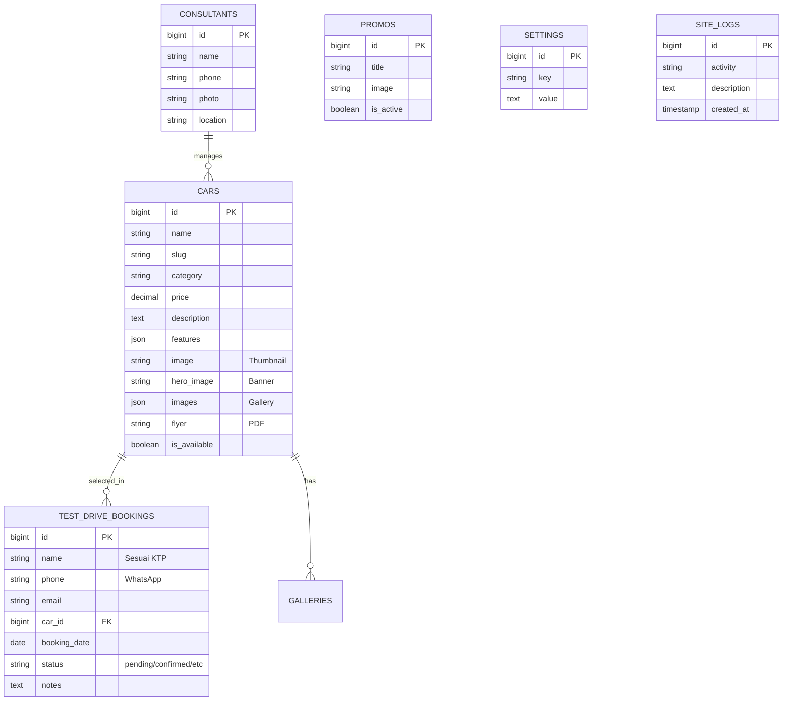

# 🏆 AutoShow Pro Portal - Premium Car Dealership System

AutoShow Pro adalah platform manajemen showroom mobil modern yang dirancang khusus untuk profesional sales. Platform ini menawarkan pengalaman visual "Pro Max" dengan fokus pada konversi tinggi melalui desain clean, integrasi WhatsApp, dan sistem manajemen inventory yang intuitif, kini dilengkapi dengan kontrol keamanan kelas dunia dan fitur developer sandbox.

---

## 📸 Preview Halaman Utama

<p align="center">
  
</p>
<p align="center">
  <em>Sistem Slideshow Hero Banner yang Sinematik</em>
</p>

---

## 🚀 Fitur Utama & Keunggulan Baru

- **Premium Showroom Landing Page**: Tampilan modern dengan tema clean white, visual glassmorphism, dan font premium *Outfit*.
- **Cinematic Hero Slideshow**: Banner produk interaktif yang menampilkan unit unggulan secara dinamis.
- **Break-the-Frame Card Design**: Desain kartu unit mobil yang artistik dengan efek overflow 3D (gambar mobil melayang melompati batas kartu).
- **Booking Test Drive System (Livewire)**: Fitur penjadwalan test drive interaktif yang terintegrasi langsung dengan notifikasi WhatsApp ke Sales.
- **Simulasi Kredit Cerdas (Livewire)**: Kalkulator kredit interaktif real-time untuk simulasi uang muka, suku bunga, tenor, dan cicilan bulanan.
- **Popup Video Promosi Premium**: Video promosi pop-up otomatis di awal kunjungan (mendukung MP4 lokal, direct URL, atau YouTube) dengan sistem *muted-first autoplay* dan tombol *Unmute* dinamis yang ramah browser.
- **WhatsApp Lead Integration**: Menghubungkan pembeli langsung dengan Sales Expert melalui tautan WhatsApp terenkripsi otomatis.
- **⚡ Developer Analytics Sandbox (Baru)**: Panel widget analitik dashboard kustom khusus untuk developer dengan tombol interaktif `Isi Data Dummy` & `Reset Data Real` bertenaga Livewire yang sangat aman (menyaring data dummy berdasarkan alamat IP `127.0.0.1` dan email `@example.com` tanpa merusak data pelanggan nyata).
- **🔐 Developer OTP Security Gate (Baru)**: Sistem otentikasi dua langkah (OTP) dinamis yang dikirimkan langsung ke email pribadi developer untuk melindungi area operasional sensitif.
- **🛡️ Hardened Security Protection (Baru)**: Penutupan celah informasi sensitif dengan penonaktifan `APP_DEBUG=false` untuk merender halaman `500 Server Error` yang aman dan elegan saat database/server mengalami gangguan.
- **🎨 Favicon Dinamis & Fallback (Baru)**: Browser tab icon dinamis yang mengikuti settingan logo di Admin Panel, terintegrasi langsung dengan fallback logo resmi Hyundai biru untuk menghilangkan total ikon Laravel merah bawaan.

---

## 📊 ERD (Entity Relationship Diagram)



---

## 🛠️ Panduan Instalasi & Deployment

Pilih metode instalasi yang sesuai dengan lingkungan hosting Anda:

---

### 🌐 Metode A: Menggunakan SSH (VPS, Cloud Server, Dedicated Server)

Metode ini sangat disarankan untuk fleksibilitas tinggi dan manajemen otomatis menggunakan Git, Composer, dan Terminal.

#### 1. Clone Repository & Masuk Direktori
```bash
git clone https://github.com/scripted42/ProjectSales.git
cd ProjectSales
```

#### 2. Install Dependensi PHP & Frontend
```bash
# Install PHP Dependencies (Production Mode)
composer install --optimize-autoloader --no-dev

# Install & Build Frontend Assets
npm install
npm run build
```

#### 3. Konfigurasi Environment File
```bash
cp .env.example .env
php artisan key:generate
```
Edit file `.env` yang baru dibuat untuk memasukkan detail database dan credentials email Anda:
```env
APP_NAME="Hyundai Showroom"
APP_ENV=production
APP_DEBUG=false
APP_URL=https://namadomainanda.com

DB_CONNECTION=mysql
DB_HOST=127.0.0.1
DB_PORT=3306
DB_DATABASE=nama_database_anda
DB_USERNAME=nama_user_database
DB_PASSWORD=sandi_database_anda

MAIL_MAILER=smtp
MAIL_HOST=smtp.gmail.com
MAIL_PORT=465
MAIL_USERNAME="email_anda@gmail.com"
MAIL_PASSWORD="sandi_aplikasi_gmail_anda"
MAIL_ENCRYPTION=ssl
```

#### 4. Migrasi Database & Hubungkan Penyimpanan
```bash
# Jalankan migrasi tabel database dan data awal (seeding)
php artisan migrate --seed

# Buat symbolic link dari storage ke public folder
php artisan storage:link
```

#### 5. Optimasi Cache & Set Permission Folder
```bash
# Bersihkan dan cache konfigurasi demi kecepatan super
php artisan config:cache
php artisan route:cache
php artisan view:cache

# Set permissions agar server web dapat menulis file logs/uploads
chmod -R 775 storage bootstrap/cache
chown -R www-data:www-data .
```

---

### 📂 Metode B: Manual Tanpa SSH (Shared Hosting / cPanel File Manager)

Gunakan metode ini jika hosting Anda adalah tipe Shared Hosting konvensional yang tidak menyediakan terminal SSH.

#### 1. Bundling Dependensi di Komputer Lokal (Sebelum Upload)
Karena Shared Hosting tidak memiliki Composer/NPM, kita harus mempersiapkan berkasnya terlebih dahulu di komputer lokal Anda:
1. Jalankan perintah `npm run build` di komputer lokal Anda untuk membuat bundel aset final di folder `public/build`.
2. Pastikan folder `vendor` di lokal sudah lengkap terinstall lewat `composer install`.
3. Kompres seluruh file dan folder proyek Anda ke dalam satu file `.zip` (misalnya: `proyek-sales.zip`). **Pastikan folder `vendor` dan `public/build` ikut terkompres di dalamnya!**

#### 2. Unggah dan Ekstrak Berkas di cPanel File Manager
1. Masuk ke **cPanel File Manager** Anda.
2. Unggah file `proyek-sales.zip` ke folder utama di luar `public_html` (misal di direktori `/home/username/ProjectSales`).
3. Ekstrak file zip tersebut di lokasi tersebut.

#### 3. Konfigurasi Folder Publik (`public_html`)
1. Buka folder `/home/username/ProjectSales/public` hasil ekstrak tadi.
2. Pindahkan **seluruh isi** folder `/public` tersebut (termasuk folder `assets`, `build`, file `index.php`, `.htaccess`, dan `robots.txt`) langsung ke dalam folder publik utama hosting Anda yaitu **`public_html`**.

#### 4. Hubungkan File `index.php` ke Inti Proyek
1. Di dalam folder `public_html`, klik kanan file `index.php` lalu pilih **Edit**.
2. Sesuaikan jalur path (`autoload.php` dan `app.php`) agar mengarah dengan benar ke folder proyek Anda di luar `public_html`. 
   Ubah baris 24 dan 38:
   ```php
   // SEBELUM:
   require __DIR__.'/../vendor/autoload.php';
   $app = require_once __DIR__.'/../bootstrap/app.php';

   // SESUDAH (arahkan ke folder ProjectSales di luar public_html):
   require __DIR__.'/../ProjectSales/vendor/autoload.php';
   $app = require_once __DIR__.'/../ProjectSales/bootstrap/app.php';
   ```
3. Klik **Save Changes**.

#### 5. Pembuatan Database & Impor Data (phpMyAdmin)
1. Di cPanel, cari menu **MySQL Database Wizard**. Buat nama database, user baru, dan kata sandi baru. Berikan hak akses penuh (*All Privileges*).
2. Masuk ke **phpMyAdmin** komputer lokal Anda, lakukan **Export** pada database lokal Anda ke dalam file `.sql`.
3. Masuk ke **phpMyAdmin** di cPanel Anda, pilih database yang baru dibuat, lalu lakukan **Import** menggunakan berkas `.sql` lokal Anda tadi.

#### 6. Pengaturan Konfigurasi `.env`
1. Buka folder `/home/username/ProjectSales/` di File Manager cPanel.
2. Buat atau edit file `.env`, lalu masukkan credentials database baru Anda beserta data email SMTP Anda seperti instruksi Metode A. Pastikan `APP_DEBUG=false` demi keamanan data.

#### 7. Membuat Storage Symbolic Link Secara Manual
Karena Shared Hosting tidak memiliki akses terminal untuk menjalankan `php artisan storage:link`, buatlah file script PHP manual:
1. Di dalam folder `/public_html`, buatlah file baru bernama `link-storage.php`.
2. Edit file tersebut dan isi dengan kode berikut:
   ```php
   <?php
   // Ganti 'username' sesuai dengan nama username cPanel Anda
   symlink('/home/username/ProjectSales/storage/app/public', '/home/username/public_html/storage');
   echo "Symbolic storage link created successfully!";
   ```
3. Buka tab baru di browser Anda dan akses: `https://namadomainanda.com/link-storage.php`.
4. Setelah muncul tulisan sukses, **segera hapus file `link-storage.php`** dari File Manager demi keamanan website Anda.

---

## 📺 Deployment pada STB (Set Top Box) Linux

Jika Anda menggunakan STB (seperti HG680P/B860H) yang menjalankan **Armbian** atau distro Linux lainnya, ikuti panduan optimasi ini:

### 1. Persiapan Lingkungan (LEMP Stack)
Pastikan PHP-FPM dan Nginx sudah terpasang untuk menghemat RAM dibandingkan Apache:
```bash
sudo apt update
sudo apt install nginx mariadb-server php-fpm php-mysql php-xml php-curl php-gd php-mbstring php-zip -y
```

### 2. Optimasi Database (Penting untuk STB)
STB memiliki RAM terbatas. Batasi penggunaan memory MariaDB:
```bash
# Edit /etc/mysql/mariadb.conf.d/50-server.cnf
# Tambahkan di bawah [mysqld]:
key_buffer_size = 16M
max_connections = 20
query_cache_size = 8M
```

### 3. Konfigurasi Nginx
Buat file config di `/etc/nginx/sites-available/autoshow`:
```nginx
server {
    listen 80;
    server_name autoshow.local;
    root /var/www/ProjectSales/public;

    add_header X-Frame-Options "SAMEORIGIN";
    add_header X-Content-Type-Options "nosniff";

    index index.php;
    charset utf-8;

    location / {
        try_files $uri $uri/ /index.php?$query_string;
    }

    location ~ \.php$ {
        fastcgi_pass unix:/var/run/php/php-fpm.sock;
        fastcgi_param SCRIPT_FILENAME $realpath_root$fastcgi_script_name;
        include fastcgi_params;
    }
}
```

### 4. Swap Memory
Jika STB Anda hanya memiliki RAM 1GB/2GB, tambahkan Swap untuk mencegah *Out of Memory*:
```bash
sudo fallocate -l 1G /swapfile
sudo chmod 600 /swapfile
sudo mkswap /swapfile
sudo swapon /swapfile
```

---

## ☁️ Deployment dengan Cloudflare Tunnel (Zero Trust)

Jika Anda ingin meng-onlinekan server lokal (seperti STB Linux, PC XAMPP, atau VM lokal) agar dapat diakses dengan domain publik tanpa perlu membuka port (*Port Forwarding*) pada router/modem ISP, gunakan **Cloudflare Tunnel**:

### 1. Registrasi Domain Baru & Hubungkan ke Cloudflare

Sebelum memasang Cloudflare Tunnel, Anda harus memiliki nama domain aktif dan mendelegasikannya ke Cloudflare:

#### A. Pembelian / Registrasi Domain Baru:
1. Kunjungi penyedia registrasi domain pilihan Anda (seperti **Domainesia**, **Niagahoster**, **Dewaweb**, atau **Namecheap**).
2. Cari nama domain yang Anda inginkan (misalnya: `hyundaisurabaya.com`).
3. Lakukan pembelian dan selesaikan proses verifikasi kepemilikan domain di portal registrar tersebut.

#### B. Menambahkan Domain ke Akun Cloudflare:
1. Daftar atau masuk ke dashboard **[Cloudflare](https://dash.cloudflare.com/)**.
2. Klik tombol **Add a Site** / **Tambahkan Situs**, lalu masukkan nama domain Anda (tanpa `www` atau `https`, cukup `hyundaisurabaya.com`).
3. Pilih paket layanan **Free** (Gratis), lalu klik **Continue**.
4. Cloudflare akan secara otomatis memindai DNS record bawaan domain Anda. Klik **Continue** lagi.

#### C. Mengubah Nameserver di Portal Registrar Domain:
1. Cloudflare akan menampilkan sepasang **Cloudflare Nameservers** baru (contohnya: `heather.ns.cloudflare.com` dan `darren.ns.cloudflare.com`).
2. Buka tab baru, masuk ke **Client Area / Portal Member** tempat Anda membeli domain tadi (misal portal Domainesia).
3. Cari menu **Domain Management** / **Kelola Domain** -> cari submenu **Nameservers**.
4. Ubah setelan Nameservers dari *"Use Default Nameservers"* menjadi *"Use Custom Nameservers"*.
5. Masukkan kedua Nameservers yang diberikan oleh Cloudflare tadi ke kolom yang tersedia (misal Nameserver 1 dan Nameserver 2). Hapus nameserver lain jika ada.
6. Klik **Save / Update Nameservers**.
7. Kembali ke dashboard Cloudflare Anda, lalu klik **Check Nameservers** -> **Finish**.

> [!NOTE]
> Proses perubahan Nameservers (disebut propagasi DNS) biasanya memakan waktu antara **5 menit hingga maksimal 24 jam** tergantung dari ISP dan registrar Anda. Anda dapat memantau status propagasi secara global menggunakan layanan seperti [DNSChecker](https://dnschecker.org/).

### 2. Instalasi Cloudflared di Server Lokal
Unduh dan pasang agen `cloudflared` di server Anda:
- **Untuk Linux Debian/Ubuntu (STB/Server):**
  ```bash
  curl -L --output cloudflared.deb https://github.com/cloudflare/cloudflared/releases/latest/download/cloudflared-linux-arm.deb # (Ganti arm dengan amd64 jika di PC/VPS biasa)
  sudo dpkg -i cloudflared.deb
  ```

### 3. Autentikasi Cloudflared
Hubungkan agen lokal server Anda dengan akun Cloudflare Anda:
```bash
cloudflared tunnel login
```
*Salin tautan URL yang muncul di terminal, buka di browser Anda, lalu setujui otorisasi domain pilihan Anda.*

### 4. Membuat Tunnel Baru
```bash
cloudflared tunnel create hyundai-tunnel
```
*Perintah ini akan menghasilkan ID Tunnel berupa string UUID yang unik dan menyimpan file rahasia kredensial JSON di folder `/root/.cloudflared/`.*

### 5. Membuat Konfigurasi `config.yml`
Buat berkas konfigurasi di direktori `/root/.cloudflared/config.yml`:
```bash
nano /root/.cloudflared/config.yml
```
Masukkan konfigurasi berikut (sesuaikan UUID dan domain Anda):
```yaml
tunnel: <UUID_TUNNEL_ANDA>
credentials-file: /root/.cloudflared/<UUID_TUNNEL_ANDA>.json

ingress:
  - hostname: hyundaisurabaya.com
    service: http://localhost:8000  # Arahkan ke port php artisan serve atau Nginx Anda
  - service: http_status:404
```

### 6. Menghubungkan Subdomain / Domain via DNS
Jalankan perintah ini agar domain utama Anda terhubung secara otomatis melalui DNS CNAME Cloudflare:
```bash
cloudflared tunnel route dns hyundai-tunnel hyundaisurabaya.com
```

### 7. Menjalankan Tunnel Sebagai Layanan Sistem (Service)
Agar tunnel tetap berjalan secara otomatis di latar belakang saat server/STB dinyalakan kembali:
```bash
# Install sebagai service sistem Linux
sudo cloudflared service install

# Jalankan dan aktifkan layanannya
sudo systemctl start cloudflared
sudo systemctl enable cloudflared
```
*Sekarang, server lokal Anda sudah terhubung secara aman di balik jaringan Cloudflare, lengkap dengan enkripsi SSL gratis (HTTPS) tanpa perlu setting IP Publik Statis!*

---

## 👤 Kontributor & Hak Cipta
- **AutoShow Pro Team** - Developer & Designer.

&copy; 2026 AutoShow Pro - Hyundai Showroom. Semua Hak Dilindungi.
