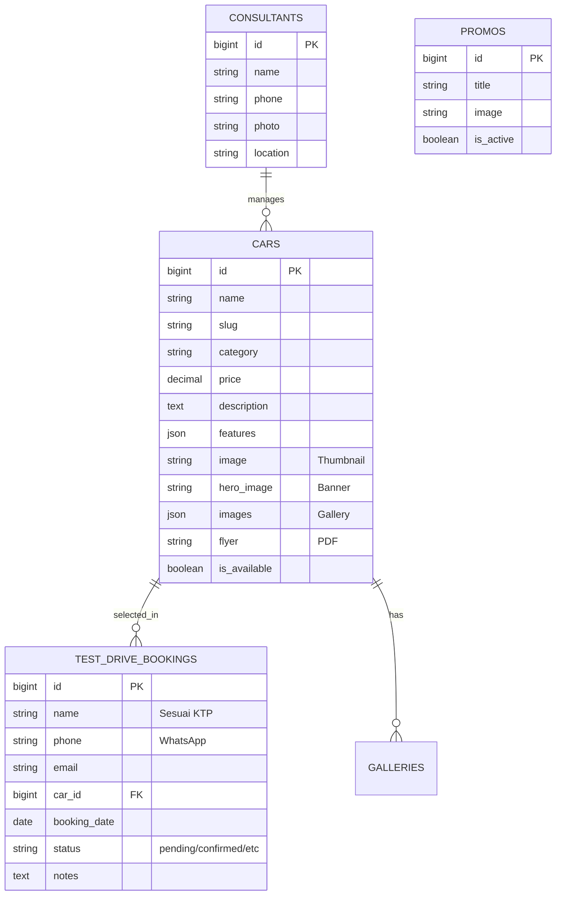

# AutoShow Pro Portal - Premium Car Dealership System

AutoShow Pro adalah platform manajemen showroom mobil modern yang dirancang khusus untuk profesional sales. Platform ini menawarkan pengalaman visual "Pro Max" dengan fokus pada konversi tinggi melalui desain clean, integrasi WhatsApp, dan sistem manajemen inventory yang intuitif.

## 🚀 Fitur Utama

- **Premium Showroom Landing Page**: Tampilan modern dengan tema clean white dan glassmorphism.
- **Cinematic Hero Slideshow**: Banner produk interaktif yang menampilkan unit unggulan secara dinamis.
- **Break-the-Frame Card Design**: Desain kartu unit mobil yang artistik dengan efek overflow 3D.
- **Booking Test Drive System**: Fitur penjadwalan test drive yang terintegrasi langsung dengan notifikasi WhatsApp ke Sales.
- **Admin Dashboard (Filament PHP)**: Kelola unit mobil, galeri foto, promo, hingga data booking dalam satu dashboard profesional.
- **WhatsApp Lead Integration**: Memudahkan calon pembeli terhubung langsung dengan Sales melalui satu klik.

---

## 📄 PRD (Product Requirements Document)

### Tujuan
Membangun portal sales mobil yang memberikan kesan premium, memudahkan customer melihat detail produk, dan mengonversi pengunjung menjadi lead melalui sistem booking dan WhatsApp.

### Target Pengguna
- Calon pembeli mobil (Customer).
- Sales Consultant (Admin).

### Kebutuhan Fungsional
1.  **Inventory Management**: Menampilkan unit mobil dengan spesifikasi, harga OTR, dan galeri foto.
2.  **Test Drive Booking**: Form pengisian data diri (KTP, WA, Email) dan pemilihan jadwal test drive.
3.  **Hero Customization**: Admin dapat mengunggah gambar banner khusus untuk setiap produk.
4.  **Admin Panel**: CRUD Car, Consultant, Promo, Video, dan Monitoring Leads/Bookings.

---

## 📊 ERD (Entity Relationship Diagram)



---

## 🛠️ Cara Penggunaan & Instalasi

### Prasyarat
- PHP >= 8.2
- Composer
- Node.js & NPM
- MySQL

### Instalasi Lokal
1.  **Clone Repository**
    ```bash
    git clone https://github.com/scripted42/ProjectSales.git
    cd ProjectSales
    ```

2.  **Install Dependencies**
    ```bash
    composer install
    npm install
    ```

3.  **Environment Setup**
    ```bash
    cp .env.example .env
    php artisan key:generate
    ```
    *Sesuaikan konfigurasi database di file `.env`.*

4.  **Database & Storage**
    ```bash
    php artisan migrate --seed
    php artisan storage:link
    ```

5.  **Run Application**
    ```bash
    npm run dev
    php artisan serve
    ```

---

## 🚢 Deployment (Production)

Untuk melakukan deployment ke VPS/Server:

1.  **Optimization**
    ```bash
    composer install --optimize-autoloader --no-dev
    php artisan config:cache
    php artisan route:cache
    php artisan view:cache
    ```

2.  **Asset Bundling**
    ```bash
    npm run build
    ```

3.  **Permissions**
    Pastikan folder `storage` dan `bootstrap/cache` dapat ditulis oleh web server:
    ```bash
    chmod -R 775 storage bootstrap/cache
    ```

---

## 👤 Kontributor
- **AutoShow Pro Team** - Developer & Designer.

&copy; 2026 AutoShow Pro - Hyundai Showroom. Semua Hak Dilindungi.
